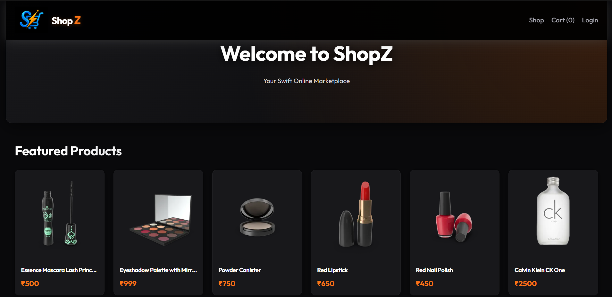
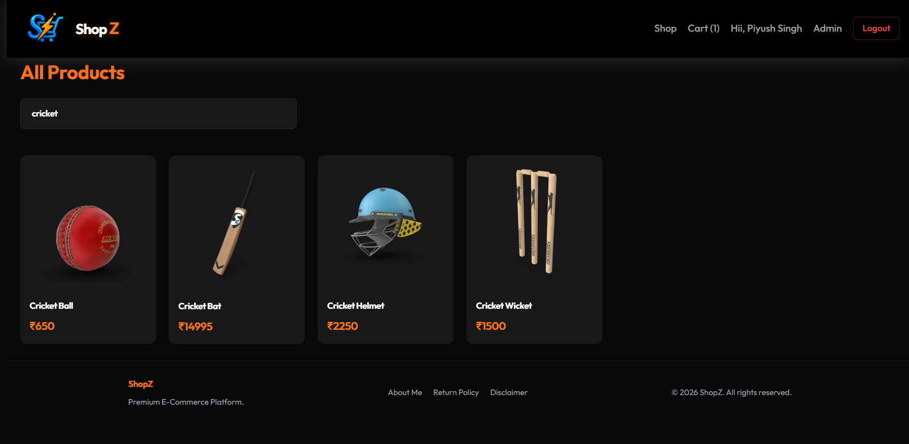
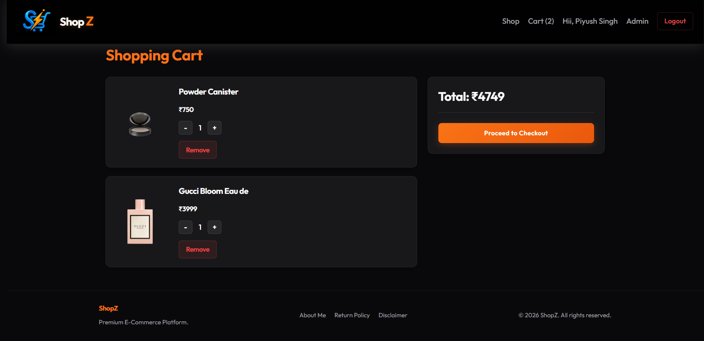
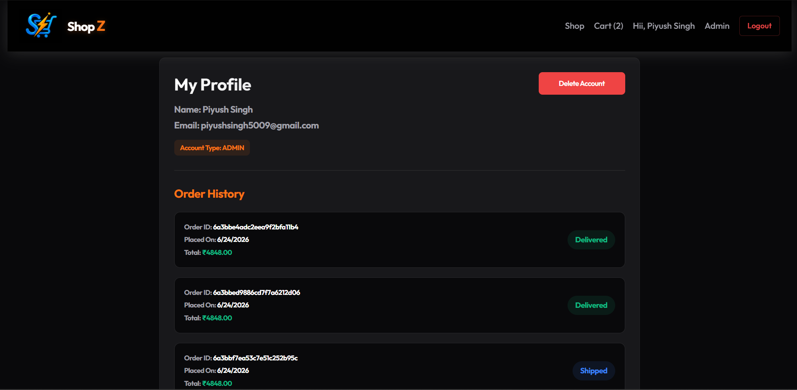
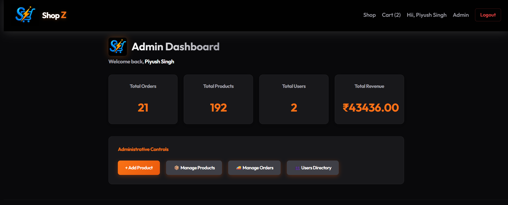
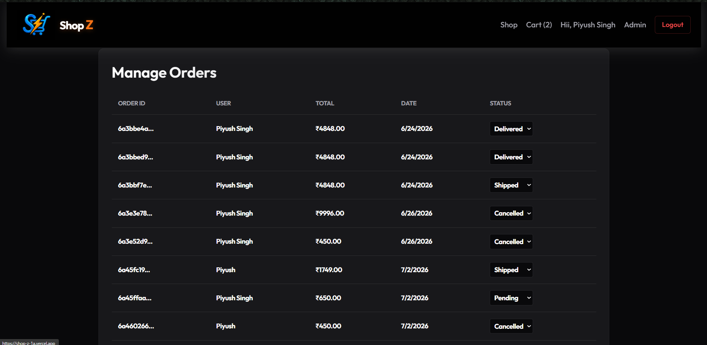
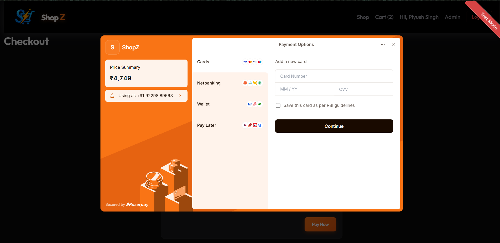

# 🛒 ShopZ - Full Stack MERN E-Commerce Platform

<div align="center">


### Premium Full Stack E-Commerce Platform

Built using the **MERN Stack** with secure authentication, admin dashboard, online payments, product management, and order tracking.


</div>

---

# 📌 Overview

**ShopZ** is a modern full-stack MERN E-Commerce application that provides a complete online shopping experience with secure authentication, online payment integration, role-based authorization, inventory management, and an admin dashboard.

The platform allows customers to browse products, search by category, manage their shopping cart, securely place orders using Razorpay, and track their order history.

Administrators can manage products, orders, users, stock levels, and monitor overall business statistics through a dedicated dashboard.

---

# 🚀 Live Features

## Customer Features

- User Registration & Login
- JWT Authentication
- Secure Password Hashing
- Browse Products
- Product Categories
- Product Search
- Product Details Page
- Shopping Cart
- Quantity Management
- Razorpay Payment Gateway
- Order Placement
- Order History
- Profile Page
- Account Deletion
- Responsive Design

---

## Admin Features

- Admin Dashboard
- Dashboard Analytics
- Add Products
- Edit Products
- Delete Products
- Manage Inventory
- Manage Orders
- Update Order Status
- User Directory
- Revenue Statistics
- Total Products
- Total Orders
- Total Users

---

# 🛠 Tech Stack

## Frontend

- React
- Redux Toolkit
- React Router DOM
- Tailwind CSS
- Context API

---

## Backend

- Node.js
- Express.js
- MongoDB
- Mongoose

---

## Authentication

- JWT
- bcryptjs

---

## Payment

- Razorpay

---

## Image Storage

- Cloudinary

---

## Email Service

- Nodemailer

---

# 📂 Project Structure

```
ShopZ
│
├── client
│   ├── src
│   ├── components
│   ├── pages
│   ├── redux
│   ├── context
│   └── assets
│
├── server
│   ├── controllers
│   ├── routes
│   ├── middleware
│   ├── models
│   ├── config
│   └── utils
│
└── README.md
```

---

# ✨ Screenshots

---

## 🏠 Home Page



Beautiful landing page showcasing featured products.

---

## 📦 Product Details


Detailed product information with stock status and Add to Cart functionality.

---

## 🔍 Product Search



Instant product searching with category filtering.

---

## 🛒 Shopping Cart



Manage product quantity, remove items, and proceed to checkout.

---

## 👤 User Profile



View profile information and complete order history.

---

## 📊 Admin Dashboard



Dashboard containing analytics, revenue, products, users, and orders.

---

## 📦 Product Management


Complete CRUD functionality for products.

---

## 📋 Order Management



Manage customer orders and update delivery status.

---

## 💳 Razorpay Checkout



Secure online payment using Razorpay.

---

# 🔐 Authentication

- JWT Authentication
- Protected Routes
- Role Based Authorization
- Admin Middleware
- Password Encryption using bcrypt

---

# 💳 Payment Flow

```
Cart
      ↓
Checkout
      ↓
Create Razorpay Order
      ↓
Payment
      ↓
Verify Payment Signature
      ↓
Create Order
      ↓
Reduce Stock
      ↓
Send Confirmation Email
```

---

# 📦 Product Management

Admin can

- Add Products
- Update Products
- Delete Products
- Upload Images

---

# 📋 Order Management

Admin can

- View Orders
- Update Order Status

Supported statuses

- Pending
- Shipped
- Delivered
- Cancelled

---

# 📈 Dashboard Statistics

Dashboard displays

- Total Revenue
- Total Orders
- Total Products
- Total Users

---

# 🔍 Search Functionality

Users can search products by

- Product Name
- Category

---

# 📧 Email Notifications

Customers automatically receive

- Order Confirmation Email
- Payment Confirmation
- Order Details

---


# 🚀 Installation

Clone repository

```bash
git clone https://github.com/piyushsingh9663/shopz.git
```

Install frontend

```bash
cd frontend
npm install
npm run dev
```

Install backend

```bash
cd backend
npm install
npm run dev
```

---

# Future Improvements

- Coupons & Discounts
- Ratings
- Multiple Payment Methods
- Address Management
- Invoice Generation
- Dark / Light Theme
- PWA Support
- Multi Vendor Support

---

# 👨‍💻 Author

**Piyush Kumar**
B.Tech CSE Student
Full Stack MERN Developer
GitHub: https://github.com/yourusername
LinkedIn: https://linkedin.com/in/yourprofile

---